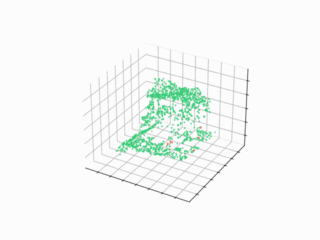
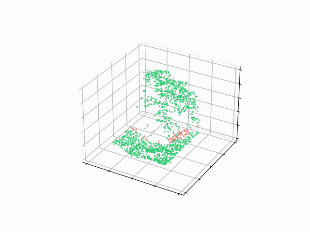
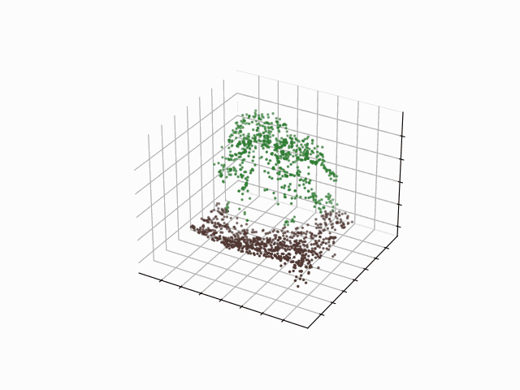
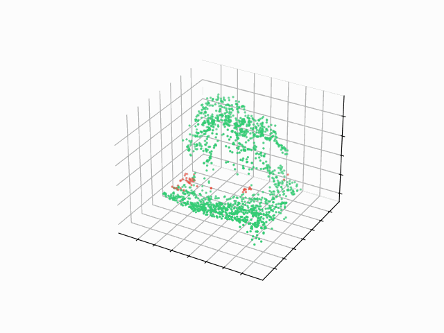
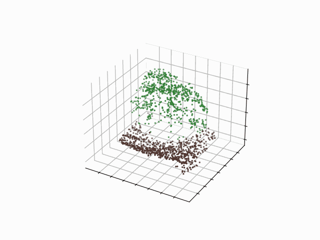
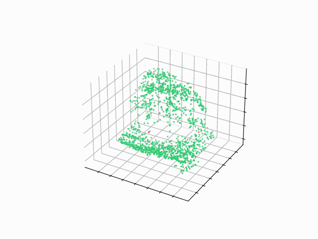
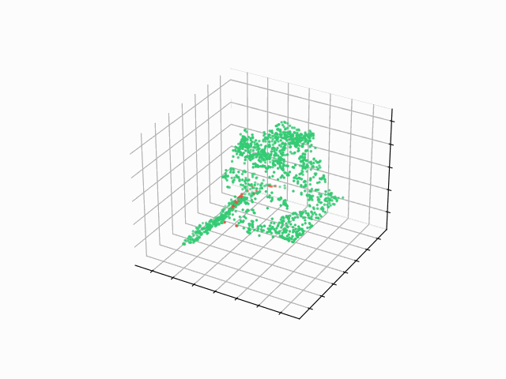
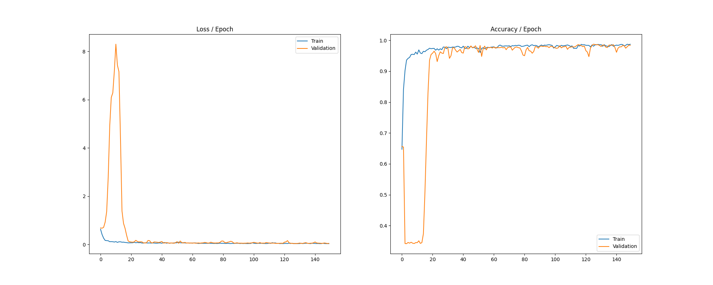

# 3D Lettuce Soil Segmentation 

## PointNet
### Examples from Test Set
<table>
    <thead>
        <tr>
            <th style="text-align: center;">Ground Truth</th>
            <th style="text-align: center;">Predicted</th>
            <th style="text-align: center;">Diff. (Error)</th>
        </tr>
    </thead>
    <tr>
        <td></td>
        <td></td>
        <td></td>
    </tr>
    <tr>
        <td></td>
        <td></td>
        <td></td>
    </tr>
    <tr>
        <td></td>
        <td></td>
        <td></td>
    </tr>
</table>

### Training Process

### Accuracy
<table style="text-align: center;">
    <thead>
        <tr>
            <th>Train Set</th>
            <th>Validation Set</th>
            <th>Test Set</th>
        </tr>
    </thead>
    <tr>
        <td>97.55%</td>
        <td>95.63%</td>
        <td>95.228%</td>
    </tr>
</table>

## RandLA-Net
### Examples from Test Set
<table>
    <thead>
        <tr>
            <th style="text-align: center;">Ground Truth</th>
            <th style="text-align: center;">Predicted</th>
            <th style="text-align: center;">Diff. (Error)</th>
        </tr>
    </thead>
    <tr>
        <td></td>
        <td></td>
        <td></td>
    </tr>
    <tr>
        <td></td>
        <td></td>
        <td></td>
    </tr>
    <tr>
        <td></td>
        <td></td>
        <td></td>
    </tr>
</table>

### Training Process

### Accuracy
<table style="text-align: center;">
    <thead>
        <tr>
            <th>Train Set</th>
            <th>Validation Set</th>
            <th>Test Set</th>
        </tr>
    </thead>
    <tr>
        <td>97.35%</td>
        <td>96.48%</td>
        <td>97.2%</td>
    </tr>
</table>

## PointNet++
### Examples from Test Set
<table>
    <thead>
        <tr>
            <th style="text-align: center;">Ground Truth</th>
            <th style="text-align: center;">Predicted</th>
            <th style="text-align: center;">Diff. (Error)</th>
        </tr>
    </thead>
    <tr>
        <td></td>
        <td></td>
        <td></td>
    </tr>
    <tr>
        <td></td>
        <td></td>
        <td></td>
    </tr>
    <tr>
        <td></td>
        <td></td>
        <td></td>
    </tr>
</table>

### Training Process

### Accuracy
<table style="text-align: center;">
    <thead>
        <tr>
            <th>Train Set</th>
            <th>Validation Set</th>
            <th>Test Set</th>
        </tr>
    </thead>
    <tr>
        <td>98.40%</td>
        <td>97.55%</td>
        <td>98.32%</td>
    </tr>
</table>
